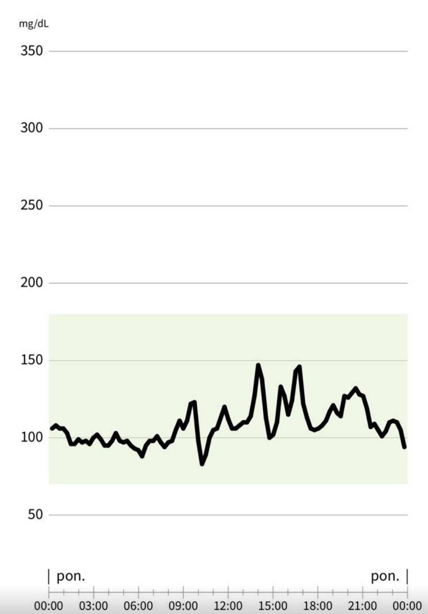

<br>

Ever wondered why some people can eat whatever they want and stay lean, while others struggle despite watching their diet? I did. As someone who spent way to many hours in the gym without seeing the abs I wanted, I started questioning if the answer lay not in my training, but in how my body processes food.

Enter the Continuous Glucose Monitor (CGM) - a tiny device that's revolutionizing how we understand our metabolism. While traditionally used by people with diabetes, these sensors have become a game-changer for anyone interested in optimizing their health. They stick to your arm and track your blood sugar 24/7, giving you real-time insights into how your body responds to everything from that morning coffee to your evening workout.


<div style="text-align:center">
  
  <br>
  <br>
  Screenshot from my Libre2 app - here we can see pretty big glucose spikes during the day
</div>

Why does this matter? Think of your blood sugar like your body's fuel gauge. When it swings too high or too low, it doesn't just affect your energy - it impacts everything from your mood to your ability to build muscle. Those dramatic spikes in blood sugar can:

- Mess with your insulin sensitivity (making it harder to lose fat)
- Trigger sudden energy crashes (hello, 3 PM slump!)
- Lead to unwanted weight gain
- Create inflammation in your body (unused glucose is toxic for the cells)

The real power of a CGM is that it turns abstract nutrition advice into personal data (and data is the new gold 💸). Instead of following general rules like "avoid sugar," you can see exactly how your morning toast or post-workout protein shake affects your body. It's like having a metabolic coach on your arm, helping you make better choices based on your unique responses.

I first got interested in CGMs after listening to [Dr. Andrew Huberman's podcast with Dr. Casey](https://www.youtube.com/watch?v=8qaBpM73NSk) about metabolic health. They discussed how these devices, once exclusively medical tools, have become surprisingly affordable and accessible. The possibility of understanding my body's responses in real-time was too intriguing to pass up.
So, armed with a Freestyle Libre 2 sensor and a determination to crack the code of my metabolism, I embarked on a two-week experiment. Here's what I learned about my body, my diet and my workouts - and how you can use this data to optimize your own health.


## Experiment setup

<br>

I was really excited when I found out that Freestyle Libre 2 sensor costs only 300zł (about $80) and works for 14 days. What made it even better was that I could download all data as CSV files. This was important to me because many devices (like Apple Watch) make it really hard to get your data out.

To start my experiment, I needed to collect three types of data:
- Glucose levels from the sensor
- What I eat and when I take medications
- My exercise activities

Getting exercise data was easy. My Garmin Fenix 7 Pro watch tracks all my workouts and lets me download everything as CSV files - I love Garmin for that reason, Apple Watch doesn't let you do that at all.

The hard part was tracking food and medications. I didn't want to use some complicated app, so I made my own solution - a Telegram bot. It's a simple program that lets me log everything using quick commands. All data goes to a `.sqlite` database on my Raspberry Pi 3B (which means hosting is basically free). If you want to make something like this yourself, you can find my code here: https://github.com/ZbigniewTomanek/my-glucose-analysis/tree/main/telegram-bot.


<div style="text-align:center">
  
  <br>
  <br>
  This turned out to be a pretty convenient way to log my food.
</div>

<br>

So, the plan was simple:
1) Get the bot up and running
2) Buy and attach the sensor
3) Log all my food and medication
4) Log all my activities
5) Analyze the data later

I decided to stick to my usual eating habits to get a realistic picture of my glucose levels. 

### A word about the sensor itself

<br>

I was genuinely impressed with the Freestyle Libre 2 sensor. It was incredibly easy to apply – just a quick twist to load the auto-syringe, then a press against a clean spot on my arm. One blink, and it was done!  An hour later, I was getting my first readings.

The sensor itself is tiny and discreet. I noticed it a bit the first night, but after that, it was easy to forget it was even there. Workouts, sleep, even a sauna session – no problems at all. The only part that stays in your body is a small, flexible plastic needle. The sharp metal one is only used for the initial placement. The adhesive was strong enough to keep things secure but didn't hurt when it was time to remove the sensor.

A few of my friends in the medical field mentioned you can buy protective stickers to extend the sensor's life, but I didn't feel the need.

<div style="text-align:center">
  
  <br>
  <br>
  This is how the sensor looks on (not my) arm.
</div>

## Data analysis

<br>

Alright, after two weeks, it was data-crunching time!  I had a mountain of info: glucose levels, food logs, workouts, and even medication. It was time to uncover some patterns. I fired up Python and Jupyter Notebooks – the classic tools for this kind of analysis. First up: visualize everything in a way that actually made sense. Then, I wanted to pinpoint the biggest culprits behind those pesky glucose spikes.

Here: https://github.com/ZbigniewTomanek/my-glucose-analysis/tree/main/data-analysis you can find the code I used for the analysis.

To find a glucose spike correlated with some food I've resampled the glucose data to 5-minute intervals, then identified maximal glucose level in the next 2 hours after a meal and found a rising slope ending in the maximum. With such a slope I was able to calculate not only the glucose spike but also the gradient of the spike.

Here's a simplified example using the McDonald's meal data:

```
Start glucose: 116.7 mg/dL
Peak glucose: 173.0 mg/dL
Time to peak: 18 minutes
Glucose delta: 56.3 mg/dL
Gradient: 18.8 mg/dL per minute
```

This means after eating three burgers and fries:
- My blood glucose rose by 56.3 mg/dL
- It reached a maximum of 173.0 mg/dL
- The rise was very steep at 18.8 mg/dL per minute

For context, a rise of more than 30 mg/dL in two hours is considered significant, and the McDonald's meal nearly doubled this threshold in just 18 minutes 😎

### Key Findings and Practical Guidelines
<br>

**1. Sauna's Impact on Glucose**
<br>

- **What I Found**: On June 22nd, saw massive glucose spike (100 to 160 mg/dL in 30 minutes)
- **Science Behind It**: This spike indicates high adrenaline release, which is actually beneficial for healthy people - it improves stress resilience and metabolism (and for me it works in a immunomodulatory manner)
- **Tips**: 
  - For healthy people: Don't worry about these spikes - they're part of the benefit
  - For diabetics: Be cautious and monitor your levels 📈
  - Consider a small protein snack before session

**2. Pizza Isn't Always Bad**
<br>

- **What I Found**: June 18th data showed Neapolitan pizza caused minimal glucose changes (only 15 mg/dL spike). This is very good since I love pizza 🍕
- **Tips**: 
  - Choose thin crust and quality ingredients
  - Traditional Italian over chain restaurants
  - Add olive oil - it might help stabilize glucose

**3. Fast Food Impact**
<br>

- **What I Found**: June 16th McDonald's meal caused the worst spike (56.3 mg/dL spike in 18 minutes)
- **Tips**:
  - Limit fast food visits
  - If eating, split into smaller portions
  - Add salad before a meal to slow glucose absorption (I know, maybe I expect too much)

**4. Smart Dessert Timing**
<br>

- **What I Found**: June 19th - ice cream after tofu with noodles showed flat curve
  June 20th - same ice cream on empty stomach caused 32.7 mg/dL spike
- **Tips**:
  - Have desserts right after protein-rich meals
  - Avoid sweets on empty stomach
  - Keep portions reasonable

Remember: These are my personal responses - yours might differ. The key is finding what works for your body through observation and testing.

You can see the full data in the PDF below.
<style>
  .pdf-container {
    position: relative; /* For aspect ratio trick below */
    width: 100%; /* Take up full width of parent */
    overflow: hidden; /* Hide any iframe overflow */
    padding-top: 75%; /* Maintain a 4:3 aspect ratio (adjust as needed) */
}

.pdf-container iframe {
    position: absolute;
    top: 0;
    left: 0;
    width: 100%;
    height: 100%;
    border: 0; /* Remove default iframe border */
}
</style>
<div class="pdf-container">
    <iframe src="glucose_reports.pdf" width="60%" height="600px">
        This browser does not support PDFs. Please download the PDF to view it: <a href="glucose_reports.pdf">Download PDF</a>.
    </iframe>
</div>


### Food Impact Analysis
<br>

Here you can find the most interesting insights from the food analysis

#### Highest Glucose Spikes
<br>

| Food | Glucose Spike (mg/dL) | Max Glucose (mg/dL) | Spike Rate (mg/dL/min) |
|------|---------------------|-------------------|---------------------|
| McDonald's (3 burgers & fries) | 56.3 | 173.0 | 18.8 |
| Naan bread with hummus & cheese | 53.0 | 158.0 | 8.8 |
| Salmon and toast | 30.3 | 150.0 | 7.6 |
| Tofu kimchi fries | 28.0 | 162.0 | 7.0 |
| Oreo ice cream | 32.7 | 135.0 | 6.5 |

#### Foods with Minimal Impact
<br>

| Food | Glucose Spike (mg/dL) | Max Glucose (mg/dL) | Spike Rate (mg/dL/min) |
|------|---------------------|-------------------|---------------------|
| Salmon salad with Huel | 0.0 | 115.0 | 0.0 |
| Poke bowl | 0.0 | 151.0 | 0.0 |
| Salad with goat cheese | 0.0 | 112.0 | 0.0 |
| Salmon with rice and salad | 0.0 | 146.0 | 0.0 |
| Toast with eggs & veggies | 0.8 | 103.0 | 0.2 |

### Key Insights from the Food Analysis
<br>

1. **Fast Food Impact**: The McDonald's meal caused the most dramatic spike, reaching 173 mg/dL with a spike rate of 18.8 mg/dL per minute - by far the highest in the dataset.

2. **Carb-Heavy Foods**: High-carb foods like naan bread and kimchi fries showed significant spikes, but interestingly, not all carb-rich foods caused dramatic increases.

3. **Protein-Rich Meals**: Foods high in protein and healthy fats, like salmon salad and poke bowls, showed minimal impact on blood glucose levels.

4. **Balanced Meals**: The data suggests that combining proteins with carbs (like salmon with rice) results in much more stable glucose responses compared to eating carbs alone.

5. **Surprising Findings**: Despite being carb-heavy, some foods like pizza showed moderate impacts, possibly due to the balancing effect of fats and proteins in the toppings.


### Activity Impact Analysis
<br>

One of the most fascinating aspects of using a CGM was discovering how different types of physical activities affect blood glucose levels. Here's what I found after analyzing two weeks of activity data.

#### Highest Glucose Responses
<br>

| Activity | Duration | Glucose Spike (mg/dL) | Max Glucose (mg/dL) | Spike Rate (mg/dL/min) |
|----------|----------|---------------------|-------------------|---------------------|
| Workout (June 17) | 2h 45m | 44.5 | 155.0 | 7.4 |
| Workout (June 19) | 2h 58m | 38.7 | 164.0 | 5.5 |
| Sauna (June 22) | 1h 01m | 22.3 | 158.0 | 7.4 |
| Workout (June 10) | 3h 27m | 19.0 | 132.0 | 1.7 |
| Workout (June 12) | 3h 02m | 18.3 | 141.0 | 2.0 |

#### Key Findings About Activities
<br>

1. **Intense Workouts**: Long cardio sessions (2-3 hours) consistently showed the highest glucose responses. The June 17 workout caused the most dramatic spike of 44.5 mg/dL with a rapid rise rate of 7.4 mg/dL per minute.

2. **Sauna Effects**: Interestingly, sauna sessions showed varied responses:
   - Some sessions caused significant spikes (June 22: 22.3 mg/dL spike)
   - Others had minimal impact (June 16: no significant spike)
   - The difference might be related to the time of day or my pre-sauna meal timing

3. **Moderate Activities**: 
   - Cycling sessions consistently showed minimal glucose impact
   - Shorter workouts (under 1 hour) generally had less dramatic effects
   - Yoga sessions showed very stable glucose levels

4. **Duration vs. Intensity**:
   - Longer workouts (2+ hours) consistently led to higher glucose spikes
   - Short, intense cycling sessions didn't cause significant spikes
   - This suggests duration might be more impactful than intensity for glucose response

#### Not All Glucose Spikes Are Created Equal
<br>

We can tell that both food and exercise could cause significant glucose spikes. However, these spikes are fundamentally different in their impact on health.

When you eat high-glycemic foods like those McDonald's burgers (which caused a 56.3 mg/dL spike), your body gets flooded with glucose quickly. This triggers a large insulin response to clear the glucose from your bloodstream. Over time, these dramatic food-induced spikes can:
- Lead to insulin resistance as your cells become less responsive to insulin
- Cause inflammation in blood vessels
- Contribute to weight gain and metabolic disorders
- Create energy crashes once the spike subsides

However, exercise-induced glucose spikes (like the 44.5 mg/dL from my long workout) are different. During exercise:
1. Your muscles are actively using the glucose for energy
2. The spike comes from your liver releasing stored glucose (glycogen) and creating new glucose (gluconeogenesis)
3. Your insulin sensitivity actually improves
4. The process is regulated by exercise hormones like adrenaline and cortisol in a controlled way

Think of it like this: a food spike is like suddenly dumping a lot of cars onto a highway (overwhelming the system), while an exercise spike is like coordinated traffic flow during rush hour (controlled and purposeful).

This is why athletes don't develop diabetes despite experiencing regular exercise-induced glucose spikes. In fact, regular exercise is one of the best ways to improve your overall glucose control and metabolic health!