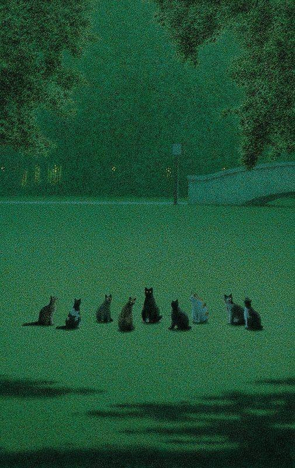

 

I believe that certain levels of artistic sensitivity, which are verging on genius, are already separated from madness by a very thin line.
I also believe that people like Haruki Murakami and Olga Tokarczuk have mastered to perfection the art of balancing on this boundary. 
In the end, they didn't get their Nobels for free.

After reading at least 10 books written by Murakami, I feel that this experience has made such a large, transformative contribution to my life that I would like to thank him.

## What makes his books so special?

 

Murakami employs a distinctive literary style, often termed `magical realism.` Initially, his narratives present as ordinary, but subtly, they unravel into surreal landscapes. This transformation eludes logical analysis. For instance, in 1Q84, the protagonist abruptly enters a parallel reality where the moon glows an eerie green, and established laws of the universe no longer govern. The undercurrent of symbolism and inherent meanings in these shifts resonate deeply within my subconscious, even though I've yet to articulate them logically.

With enough immersion, Murakami's prose attains psychoactive qualities, evoking an almost dreamlike sensation. Among friends, we playfully describe this experience as being 'murakamized.' Rest assured, aside from occasional existential doubt or unusual focus on minute details, this state doesn't typically incite adverse effects.

    
     
    Painting by Quint Buchholz giving strong Murakami vibe

 

His narratives are rooted in realism as well. Murakami's characters are so vividly specific, it's almost as if they were drawn from real life. This authenticity extends to his depictions of intimate encounters. For instance, nowhere else can one find such a unique and poignant description of an encounter with a middle-aged, salaried housekeeper. The same realism is palpable in his  [reportage on Tokyo gas attack](https://www.goodreads.com/book/show/17801.Underground), where he meticulously details each real-life character, a testament to his deep respect for their stories.

### What do I owe to Murakami?

 

- I learned to see the magic and charm of seemingly boring aspects of reality ([ref](https://www.harukimurakami.com/book/the-wind-up-bird-chronicle))
- I came to appreciate the transformative power of going through tough personal experiences ([ref](https://www.harukimurakami.com/book/kafka-on-the-shore))
- I experienced how powerful and painful romantic love can be ([ref](https://www.harukimurakami.com/book/norwegian-wood))
- I appreciated drinking whiskey on the rocks to classical music played from the turntable
- I gained the aesthetic sensitivity to appreciate someone's ears
- I appreciated deriving satisfaction from my life routine
- I fell in love with vision of [The end of the world](https://www.harukimurakami.com/book/hard-boiled-wonderland-and-the-end-of-the-world)

I also highly recommend `Drive my car movie` based on Murakami's short story. It's a highly aesthetical, slow-paced, and deeply moving film about love, loss, and forgiveness.

<iframe width="560" height="315" src="https://www.youtube.com/embed/6BPKPb_RTwI" title="YouTube video player" frameborder="0" allow="accelerometer; autoplay; clipboard-write; encrypted-media; gyroscope; picture-in-picture; web-share" allowfullscreen></iframe>

