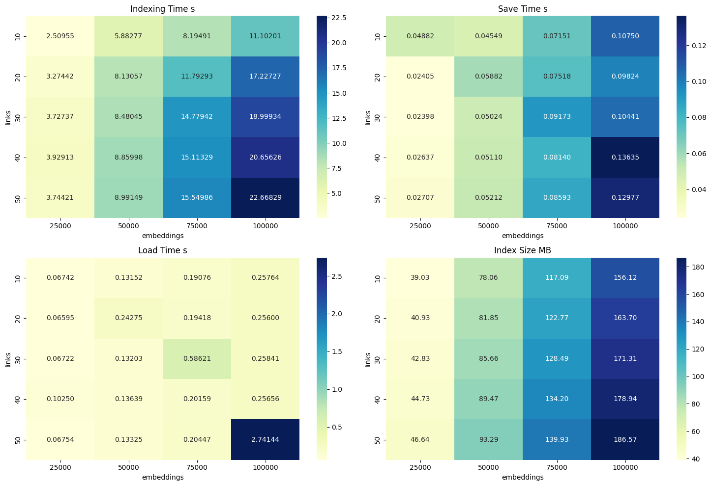

<br>

In the era of powerful LLMs boom all topics around embeddings and vector stores became a pretty hot topic.
Nowadays, it's the quick search for embeddings that makes it easy to add long-term memory to a chatbot or recommend similar videos or songs to your users.

<br>

However, when you have a large number of embeddings, the search for the nearest neighbors becomes a challenge. Comparing each embedding with all others is not an option. The complexity of such a solution would be O(n^2). Because of that, we need to use some kind of a trick to reduce the complexity to O(n*log(n)) or even O(n). These techniques are called Approximate Nearest Neighbor (ANN) algorithms. They trade off some of the search accuracy the speed.

<br>

**All data and charts were generated using [these notebooks](https://github.com/ZbigniewTomanek/zbeegnew-blog/tree/main/resources/tech/ann_for_text_embeddings).**

## My goal

<br>

There is a lot of ready product and solutions which come with the Vector Search functionality included, such as chroma or pinecone.
However, my goal was to extend a column-oriented database with a vector search feature.

This a non-trivial task, because most of ANN algorithms are designed to work with a stateful in-memory data structures called indexes. This works really well in [row oriented databases](https://github.com/pgvector/pgvector), where the data is stored in a row-oriented manner and there is native support for in-memory indexes where in most column-oriented databases don't support such indexing, because the data is sorted in column-oriented projections which act as an index.

Therefore I had to find a way to bypass this limitation, and for that I needed ANN techniques which don't produce very heavy index representation, because I had to store it in the database and load and recreate it on every search query. While doing research I've stumbled on a technique called [Locality Sensitive Hashing](https://www.bogotobogo.com/Algorithms/Locality_Sensitive_Hashing_LSH_using_Cosine_Distance_Similarity.php) which seemed to be a perfect fit for my use case.


## And a plan

<br>
LSH has looked very promising, because instead of keeping few hundred of megabytes of index it requires storing only few hyperplane matrices which are few kilobytes each. Then for every indexed vector I can calculate corresponding LSH value, calculate LSH hash for the query vector and calculate the distance only between vectors which have the same LSH hash. This way I can reduce the number of distance calculations from O(n) to O(n/k^2) where k is the number of hyperplanes. 

<br>
<br>

Basic LSH implementation can look like this:

```python
class HyperBin:
    def __init__(self, num_hyperplanes: int, num_dims: int) -> None:
        self.uuid = str(uuid.uuid4())
        self.hyperplanes = np.random.normal(size=(num_hyperplanes, num_dims))
        norms = np.linalg.norm(self.hyperplanes, axis=1, keepdims=True)
        self.hyperplanes = self.hyperplanes / norms

    def get_bin(self, point: np.array) -> int:
        dot_products = np.dot(self.hyperplanes, point)
        bin_index = np.where(dot_products > 0, 1, 0)
        bin_index = int("".join(bin_index.astype(str)), 2)
        return bin_index
```

<br>

## Plain LSH performance

<br>

But before putting anything to the Database I've decided first to benchmark LSH against the brute force approach in plain python.
So I've:

1) Taken 21,6k short [reuters](https://huggingface.co/datasets/reuters21578/viewer/ModHayes) texts
2) Split them into chunks of len 256 with overlap of length 10
3) Created embeddings for each chunk using [sentence-transformers](https://www.sbert.net/) library and `all-MiniLM-L6-v2` model
4) And checked how many results returned by LSH are the same as the results returned by brute force approach.

I've done this test on subset of 10k embedding vectors, where I've been searching for 30 nearest neighbors of 100 test samples.
I've included also a simple heuristic which creates multiple LSH indexes and then joins the results from each index. This way I can increase the number of results returned by LSH and increase the probability of finding the nearest neighbors.

<br>


<div style="text-align:center">
    
    <br>
    Misses for the plain LSH. `num_of_bins` is the number of redundant LSH indexes.
</div>

## Further improvements

<br>

The results were not satisfying at all. The search accuracy was reasonable only for 4 and 5 hyperplanes, where this is not a great game changer, because it gives maximally 32 possible hash values, which would give only an order of magnitude speedup.

<br>

It seemed kinda obvious that the main drawback here is the naive way of creating hyperplanes. So I've decided to try to improve the hyperplane creation process. I've tried two approaches:

- naively create hyperplanes going through the center of the mass of the data
- use k-means to calculate clusters and then use these clusters as hyperplanes

<br>


<div style="text-align:center">
    
    <br>
    Misses for the  centered LSH. `num_of_bins` is the number of redundant LSH indexes.
</div>

<br>

<div style="text-align:center">
    
    <br>
    Misses for the KMeans LSH. `num_of_bins` is still the number of redundant LSH indexes but it does not make much sense here (I was too lazy to change the code)
</div>

<br>
<br>
Success <span class="emojify">🎉</span> When the naive centered approach still sucks, the KMeans approach hits the right spot. It gives a huge speedup and the search accuracy seems to be pretty good.

<br>

Then I was curious how expensive calculation of KMeans cluster is.
<div style="text-align:center">
    
    <br>
    Time to calculate KMeans clusters for different number of clusters on 100k embeddings.
</div>

<br>

Wow! `sklearn` implementation of KMeans is really fast. Less than 4s to index 100k vectors? I can live with that.


## Know your baseline

<br>

But still, I was not sure if this is a really good result. Therefore I've decided to compare it with the performance of two cutting edge techniques

- HNSW from [hnswlib](https://github.com/nmslib/hnswlib) - [hierarchical navigable small world graphs implementation](https://www.pinecone.io/learn/series/faiss/hnsw/)
- [annoy](https://github.com/spotify/annoy) from Spotify - it uses [product quantization](https://www.pinecone.io/learn/series/faiss/product-quantization/) under the hood)

And these were the results: 

<div style="text-align:center">
    
    <br>
    Annoy misses (3000 is max) on the same samples/data with different number of trees and metrics.
</div>

<br>

<div style="text-align:center">
    
    <br>
    HNSW misses (3000 is max) on the same samples/data with different number of trees and metrics.
</div>

<br>

Damn. It seems that at least on this case KMeans LSH outperforms both HNSW and Annoy. However, it does not mean that it is generally better. I've tested that only on this particular dataset with 384 dimensional embeddings.

<br>

I was also curious how long does it take to build, load, and save the index for each of these methods. So I've measured that too:

<div style="text-align:center">
    
    <br>
    Annoy performance and index size
</div>

<br>

Here we can see that Annoy index for 50 trees, which is still not a lot, is already 213MB. But I have to admit that indexing time is really good and also they've made a great job with the index load speed by utilization of `mmap`.

<br>

<div style="text-align:center">
    
    <br>
    HNSW performance and index size
</div>

<br>

In comparison, HNSW does not look that great. It takes much slower to both compute and load from disk. But the index size is a bit smaller.


## Conclusion

<br>

I feel that this can be a valuable insight into ANN algorithms. Honestly, I've supposed that because of curse of dimensionality there is no way to make LSH perform similar to HNSW or Annoy. But it seems that it is not true. 

If you want to learn more, Pinecone has made excellent tutorials, guiding step by step through different vector search algorithms. You can find it [here](https://www.pinecone.io/learn/series/faiss/).


