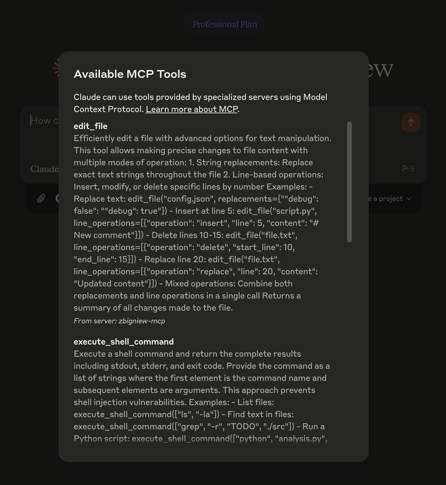
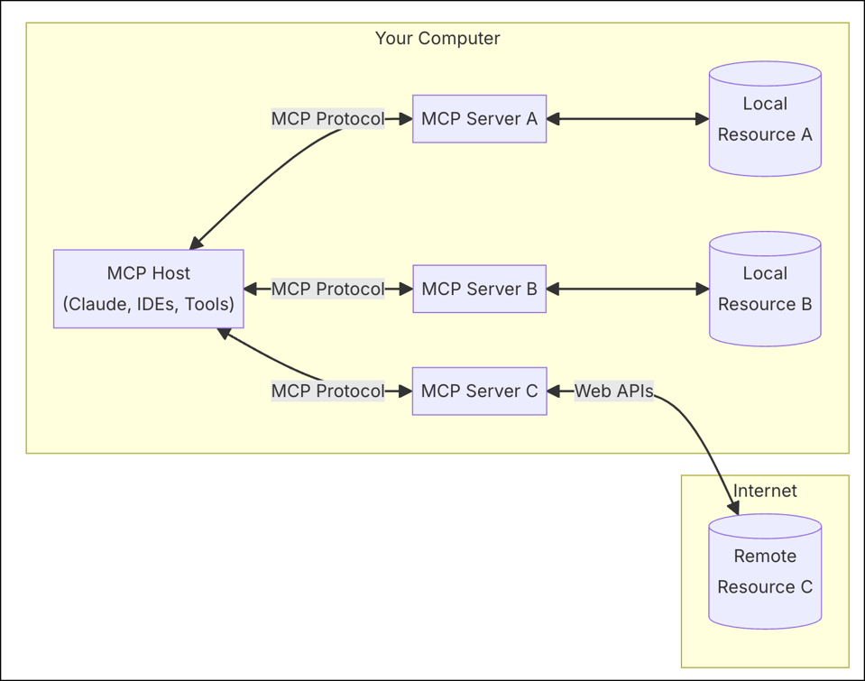
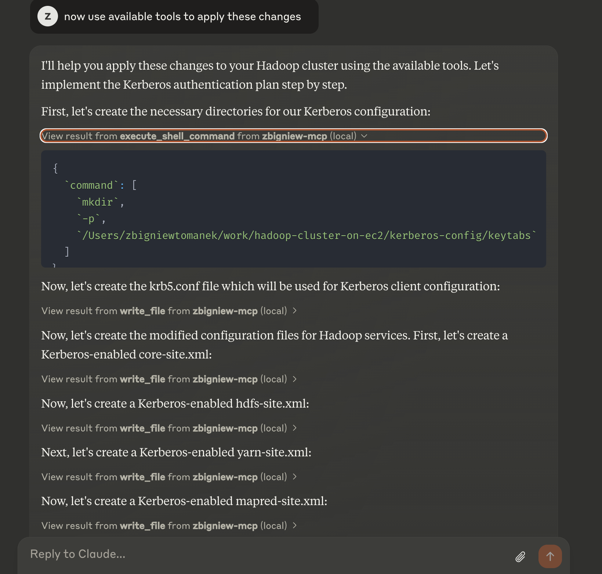

<br>

## Introduction: From Day-Long Tasks to Minutes with Claude + MCP

<br>

Last week, I faced a daunting task: implementing Kerberos authentication for my Hadoop cluster on EC2. (Yes I could use EMR but it's waaaay to expensive). 

For those unfamiliar, Kerberos is a complex network authentication protocol that typically requires careful configuration across multiple files and services. This would normally take me a full day of work, reading documentation, and troubleshooting errors.

Instead, I spent 10 minutes setting up my MCP server with Claude, described the goal, and watched in amazement as Claude:

1. Examined my project's structure and existing Docker configuration
2. Analyzed my current core-site.xml, hdfs-site.xml, and environment files
3. Created a comprehensive implementation plan for Kerberos authentication
4. Created all necessary configuration files (krb5.conf, modified XML configs)
5. Built scripts for generating Kerberos principals and keytabs
6. Created a new Kerberos-enabled docker-compose file
7. Wrote detailed documentation explaining the entire implementation
8. Even fixed YAML validation errors when I reported them

All of this happened through a natural conversation, with Claude using my MCP tools to read files, create new ones, and edit existing configurations. Claude knew exactly which components needed modification for Kerberos to work properly. What would have consumed my entire day was completed while I sipped my morning coffee.

<div style="text-align:center">
    
    <br>
    Preview of the MCP tools available for Claude
</div>

<br>

This experience showed me the incredible potential of combining Claude's intelligence with local system access through MCP. You can see the full conversation [here](https://claude.ai/share/9b229911-00ea-4c43-8ee5-04fd8e372794).

It's hard not to notice that the so-called "Vibe Coding" is really hot right now. Honestly, I'm not a big fan of it - such an approach can harness incredible power, but often I find it hard to wrap my head around the generated code and maintain it. However, it's great for fast-paced prototyping and development of your little pet projects.

To "Vibe Code" properly, developers are turning to specialized AI coding tools like Cursor, but these solutions come with additional costs and potential privacy concerns. What if you could get similar capabilities using your existing Claude Pro subscription, without spending extra money?

<div style="text-align:center">
    
    <br>
    Vibe coder in his natural habitat
</div>

<br>

In this post, I'll show you how to create your own AI coding assistant using MCP with Claude Pro. You'll learn how to:

1. Save money compared to specialized tools
2. Maintain complete control over your tools and data
3. Create powerful coding assistance tailored to your needs


**Cost Saving:** This MCP approach works with your existing Claude Pro subscription ($20/month) compared to Cursor Pro ($20/month) - potentially saving $240 per year while giving you greater control.


I came up with this idea after playing with the Model Context Protocol - it turned out that it's insanely easy to write your own server and connect it to Claude. Having such a server makes Claude use its hidden agentic logic, so it's able to smartly iterate over steps toward the goal you've set.

## The Kerberos Example: A Closer Look
<br>

Before diving into the technical details of MCP, let me share more about the Kerberos implementation that convinced me of this approach's power.

When I asked Claude to help implement Kerberos for my Hadoop cluster on EC2, it first assessed my environment by reading my project's README.md:

```
show_file("/Users/zbigniewtomanek/work/hadoop-cluster-on-ec2/README.md")
```

Then it examined my Docker Compose configuration to understand the cluster setup:

```
show_file("/Users/zbigniewtomanek/work/hadoop-cluster-on-ec2/docker-compose.yml")
```

Next, it checked my existing Hadoop configuration files:

```
show_file("/Users/zbigniewtomanek/work/hadoop-cluster-on-ec2/hadoop-config/core-site.xml")
show_file("/Users/zbigniewtomanek/work/hadoop-cluster-on-ec2/hadoop-config/hdfs-site.xml")
show_file("/Users/zbigniewtomanek/work/hadoop-cluster-on-ec2/hadoop.env")
```

After thoroughly analyzing these files, Claude developed a comprehensive plan and then implemented it step by step:

1. Created directories for Kerberos configuration:
   ```
   mkdir -p /Users/zbigniewtomanek/work/hadoop-cluster-on-ec2/kerberos-config/keytabs
   ```

2. Created krb5.conf with realm settings for Hadoop:
   ```
   write_file("/Users/zbigniewtomanek/work/hadoop-cluster-on-ec2/kerberos-config/krb5.conf", "[libdefaults]...")
   ```

3. Modified core-site.xml to enable Kerberos authentication:
   ```
   write_file("/Users/zbigniewtomanek/work/hadoop-cluster-on-ec2/kerberos-config/core-site.xml", "<?xml...")
   ```

4. Added Kerberos settings to hdfs-site.xml:
   ```
   write_file("/Users/zbigniewtomanek/work/hadoop-cluster-on-ec2/kerberos-config/hdfs-site.xml", "<?xml...")
   ```

5. Created automation scripts for keytab generation and user authentication:
   ```
   write_file("/Users/zbigniewtomanek/work/hadoop-cluster-on-ec2/generate-keytabs.sh", "#!/bin/bash...")
   write_file("/Users/zbigniewtomanek/work/hadoop-cluster-on-ec2/kinit.sh", "#!/bin/bash...")
   ```

6. Created a completely new docker-compose-kerberos.yml with all required settings:
   ```
   write_file("/Users/zbigniewtomanek/work/hadoop-cluster-on-ec2/docker-compose-kerberos.yml", "version: \"3\"...")
   ```

7. Wrote detailed documentation for the Kerberos implementation:
   ```
   write_file("/Users/zbigniewtomanek/work/hadoop-cluster-on-ec2/KERBEROS-README.md", "# Hadoop Cluster on EC2 with Kerberos Authentication...")
   ```

When I reported an error with the docker-compose file (boolean values that should be strings), Claude immediately fixed it:

```
edit_file("/Users/zbigniewtomanek/work/hadoop-cluster-on-ec2/docker-compose-kerberos.yml", 
  replacements:{
    "CORE_CONF_hadoop_security_authentication: kerberos": "CORE_CONF_hadoop_security_authentication: \"kerberos\"", 
    "CORE_CONF_hadoop_security_authorization: true": "CORE_CONF_hadoop_security_authorization: \"true\"", 
    "CORE_CONF_hadoop_rpc_protection: privacy": "CORE_CONF_hadoop_rpc_protection: \"privacy\""
  })
```

What impressed me most was Claude's ability to:
- Understand my Docker-based Hadoop architecture from reading the configuration files
- Recognize all the necessary components that needed Kerberos configuration
- Create not just individual changes but a complete, comprehensive Kerberos implementation
- Handle the complex interdependencies between services in the configuration
- Fix technical issues that arose during the process
- Provide detailed documentation about the implementation

This level of assistance would typically require a specialized DevOps consultant with deep knowledge of both Hadoop and Kerberos security - and would cost hundreds of dollars for just a few hours of work.

## The Cost of AI Coding Tools and the MCP Alternative
<br>

Let's look at the costs of some popular AI coding tools:

| Tool | Monthly Cost | Yearly Cost |
|------|--------------|-------------|
| Cursor Pro | $20 | $240 |
| GitHub Copilot | $10 | $120 |
| Claude Pro | $20 | $240 |
| Claude Pro + MCP | $20 | $240 |

For developers and small teams, these costs add up quickly. Many of us face "subscription fatigue" with multiple monthly tools. Each additional subscription increases your expenses and complicates your budget.

### Enter the Model Context Protocol (MCP)
<br>

The Model Context Protocol is an open protocol that standardizes how applications provide context to Large Language Models (LLMs). Think of MCP like a USB-C port for AI applications - it provides a standard way to connect AI models to different data sources and tools.

MCP offers several key benefits:

- Works with your existing Claude Pro subscription
- No additional API costs or token burning
- You control your tools and data
- Highly customizable to your specific needs

The protocol is currently under active development by Anthropic and others, and soon it should be production-ready for many use cases. [Here](https://modelcontextprotocol.io/) you can learn more about the future of MCP; they will soon add support for OAuth2 and remote servers.

<div style="text-align:center">
    
    <br>
    Architecture of the Model Context Protocol (MCP)
</div>

## The Python SDK - Simplifying MCP Server 
<br>

The [Python SDK for MCP](https://github.com/modelcontextprotocol/python-sdk) makes it simple to create your own MCP server. The SDK provides:

- A simple decorator-based API
- Built-in transport handling
- Type checking and validation

Here's a minimal "hello world" MCP server implementation:

```python
from mcp.server.fastmcp import FastMCP

mcp = FastMCP("hello-world-server")

@mcp.tool(
    description="Say hello to someone"
)
def say_hello(name: str) -> str:
    return f"Hello, {name}!"
```

## Claude Desktop's MCP Integration
<br>

Claude Desktop has built-in support for MCP, making it easy to connect to your custom tools. The integration includes:

- Agentic logic that helps Claude understand when to use tools
- Support for chains of operations
- Smart decision-making about which tools to use for specific tasks

Official release of Claude Desktop is available for Windows and MacOS, you can download it [here](https://claude.ai/download).

Connecting Claude Desktop to a local MCP server is straightforward - you just need to provide the server identifier and Claude will handle the rest.

<div style="text-align:center">
    
    <br>
   Claude Desktop MCP Connection UI
</div>

## Building My Custom MCP Server - The Cost-Effective Alternative
<br>

I built my own MCP server to create a cost-effective alternative to specialized coding tools. My motivation was simple:

- Save money compared to specialized tools
- Maintain complete control over my data and tools
- Create a custom solution tailored to my specific workflow

You can set it up yourself using the code and instructions from [this repository](https://github.com/ZbigniewTomanek/my-mcp-server).

<div style="text-align:center">
    
    <br>
    Here you can see how Claude is using available tools to add Kerberos to my Hadoop cluster. You can take a look at the full conversation <a href="https://claude.ai/share/9b229911-00ea-4c43-8ee5-04fd8e372794">here</a>
</div>


**Security Warning:** The MCP server executes commands as your user, an LLM can easily brick your machine if you're not careful. Make sure to run the server in a secure environment and limit its access to sensitive data 


### Cost 
<br>

By using Claude Pro with MCP instead of specialized tools, I save about $240 per year. That might not sound like much, but it adds up over time - especially if you're using multiple tools.

### Data Privacy Advantages
<br>

With this approach, your code stays on your machine. You send instructions only directly to Anthropic's AI, and they have strong privacy policies in place to protect your data.

### Overview of my MCP server
<br>

My current MCP server implements several useful tools:

- **File system operations**: Read, write, edit, and search files
- **Shell command execution**: Run commands and get the results
- **Regular expression search**: Find patterns in files
- **File editing**: Make precise changes to files

## Self-Improvement Loop: Claude Enhancing Its Own Tools
<br>

One of the most fascinating discoveries I made while building this system was that Claude could improve its own tools. This created a powerful self-improvement loop that commercial tools simply can't match.

### The First Iteration
<br>

My initial MCP server implementation included basic tools:

```python
@mcp.tool(
    description="Execute a shell command and return the results."
)
def execute_shell_command(command: list[str]) -> str:
    result = subprocess.run(
        command,
        stdout=subprocess.PIPE,
        stderr=subprocess.PIPE,
        timeout=timeout,
        text=True
    )
    if result.returncode != 0:
        return f"Error executing command: {result.stderr}"
    return result.stdout
```

While functional, I noticed Claude sometimes had difficulty with these tools. Especially efficient text editing was hard to grasp at first.

### The Breakthrough: Letting Claude Modify Its Own Server
<br>

Then I had a realization - Claude could read the server code using its own tools, understand it, and suggest improvements. I asked Claude:

> "Examine the MCP server code under `/Users/zbigniewtomanek/PycharmProjects/my-mcp-tools/server.py` and suggest improvements to make the tools more convenient for you to use"

Claude first read the server code:

```python
show_file("server.py")
```

Then after analyzing the implementation, it suggested specific improvements:

```python
edit_file("server.py", replacements={
    "def execute_shell_command(\n        command: list[str],\n        timeout: int = 60\n) -> dict:": 
    "def execute_shell_command(\n        command: list[str],\n        timeout: int = 60,\n        working_dir: str = None\n) -> dict:"
})
```

It also added more robust error handling, better documentation, and additional features that made the tools more convenient from Claude's perspective.

### Before and After: Tools Redesigned by AI for AI
<br>

Here's a comparison of the original tool and Claude's improved version:

**Original (Human-Designed):**
```python
@mcp.tool(
    description="Execute a shell command and return the results."
)
def execute_shell_command(command: list[str]) -> str:
    ...
```

**Improved (Claude-Designed):**
```python
@mcp.tool(
    description="""
    Execute a shell command and return the complete results including stdout, stderr, and exit code.

    Provide the command as a list of strings where the first element is the command name and 
    subsequent elements are arguments. This approach prevents shell injection vulnerabilities.

    Examples:
    - List files: execute_shell_command(["ls", "-la"])
    - Find text in files: execute_shell_command(["grep", "-r", "TODO", "./src"])
    - Run a Python script: execute_shell_command(["python", "analysis.py", "--input", "data.csv"])
    - Get system info: execute_shell_command(["uname", "-a"])

    The command will timeout after the specified seconds (default: 60) to prevent hanging.
    """,
)
def execute_shell_command(
        command: list[str],
        timeout: int = 60,
        working_dir: str = None
) -> dict:
    """Execute a shell command and return comprehensive results."""
    try:
        result = subprocess.run(
            command,
            stdout=subprocess.PIPE,
            stderr=subprocess.PIPE,
            timeout=timeout,
            cwd=working_dir,
            text=True
        )

        return {
            "stdout": result.stdout,
            "stderr": result.stderr,
            "exit_code": result.returncode,
            "command": " ".join(command),
            "success": result.returncode == 0
        }
    except subprocess.TimeoutExpired:
        return {
            "stdout": "",
            "stderr": f"Command timed out after {timeout} seconds",
            "exit_code": -1,
            "command": " ".join(command),
            "success": False
        }
    except Exception as e:
        return {
            "stdout": "",
            "stderr": f"Error executing command: {str(e)}",
            "exit_code": -1,
            "command": " ".join(command),
            "success": False
        }
```

You can see the improvements Claude suggested:
- Much more detailed documentation with examples
- Better parameter structure
- Enhanced error handling with specific cases
- Added working directory support
- More comprehensive return values

### The Virtuous Cycle
<br>

This created a powerful feedback loop:

1. Claude uses the tools and identifies limitations
2. Claude suggests code improvements
3. Claude implements those improvements using its own edit_file tool
4. Claude uses the improved tools, which better match its needs
5. Repeat...


**Pro Tip:** This self-improvement loop helps your tools evolve to match your specific workflow without requiring you to personally code every enhancement. Let Claude analyze its own usage patterns and suggest improvements.


### Why This Matters
<br>

This self-improvement capability provides three significant benefits:

1. **Cost-effective evolution**: Your tools improve over time without additional development costs
2. **AI-optimized interfaces**: Claude designs interfaces that work well for an AI assistant (a unique perspective)
3. **Custom tooling**: You get specialized tools that commercial solutions don't offer

Perhaps most importantly, this demonstrates how your DIY approach isn't just a cheaper alternative to commercial tools - in some ways, it's actually more powerful, as the tools evolve to match your specific needs and workflows.

The commercial tools can't modify themselves to better serve your particular use cases, but your Claude-powered MCP server can. This represents a major advantage over subscription services that offer the same fixed feature set to all users.

## Where Custom MCP Shines vs. Commercial Tools
<br>

### Where Custom MCP Shines
<br>

The MCP + Claude Pro approach has several advantages:

- **Cost effectiveness**: Use your existing Claude Pro subscription
- **Data control and privacy**: Your code never leaves your machine unless you choose to share it
- **Customization**: You can create tools for your specific workflows
- **Self-improvement**: Claude can enhance its own tools
- **Complex task automation**: As shown in the Kerberos example, Claude can handle complex multi-step processes

### Where Paid Tools Have Advantages
<br>

Commercial tools do have some benefits:

- **User interface**: More polished, integrated experiences
- **Pre-built integrations**: Ready-to-use connections to popular services
- **Support**: Professional support and regular updates
- **IDE integration**: Seamless integration with popular IDEs

### When to Choose Each Approach
<br>

Consider the MCP + Claude Pro approach if:
- You're already paying for Claude Pro
- You value privacy and data control
- You need highly customized tools
- You're comfortable with a DIY approach
- You need help with complex system administration tasks

Consider commercial tools if:
- You need seamless IDE integration
- You prefer polished user interfaces
- You value professional support
- You're less concerned about privacy

### Future Improvements
<br>

It's not very hard to imagine how this approach could be improved:
- Better IDE integration through plugins
- Support for the language server protocol (LSP)
- Integration with existing knowledge bases and APIs

However I'm not planning to push this much further, I'll be adding tools that make my work more efficient since I like hacking around and I'm not a big fan of polished solutions that want a subscription fee, my data and my soul.


## Conclusion
<br>

Building your own AI coding assistant using MCP and Claude Pro offers a cost-effective alternative to specialized tools like Cursor. This approach provides:

- Significant cost savings compared to commercial solutions
- Complete control over your tools and data
- Powerful customization options
- The ability for your tools to self-improve

As I demonstrated with the Kerberos implementation for Hadoop, this combination can transform day-long complex tasks into quick, automated processes. While there are tradeoffs in terms of polish and integration, the benefits make this a compelling option for many developers - especially those who value privacy and customization.

As MCP continues to evolve, this approach will only get better. The open protocol allows for community contributions and innovations that proprietary solutions can't match.

I encourage you to try building your own MCP server and experience the benefits firsthand!
