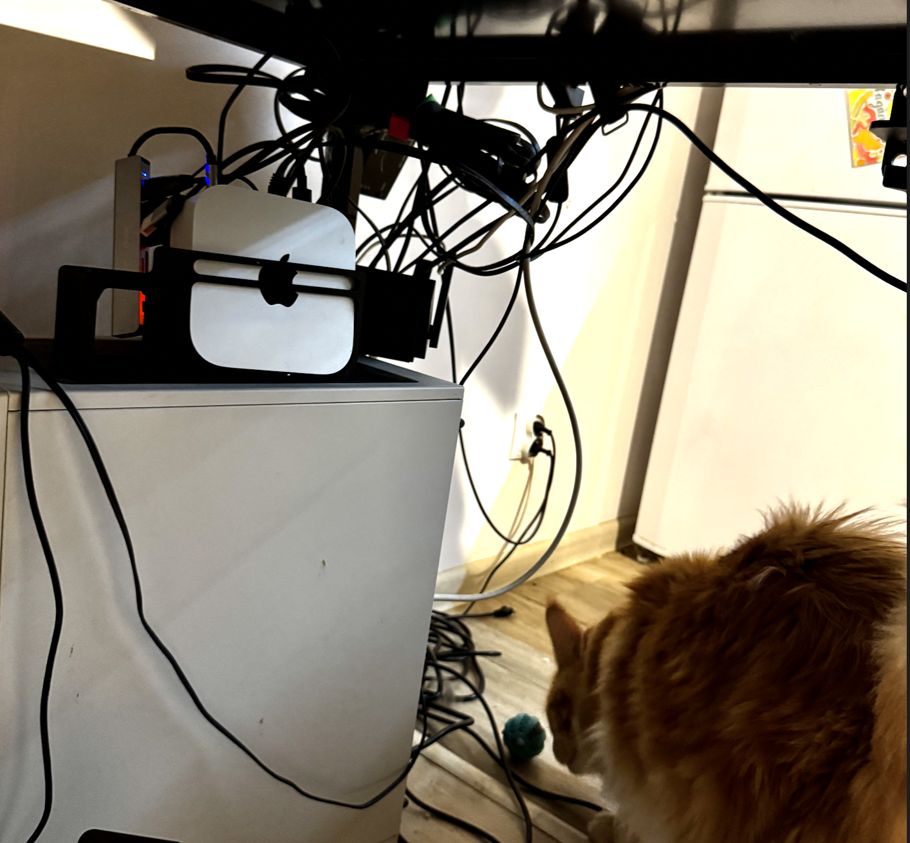

<br>
I have a personal AI assistant that I've been already building for some time. It’s a Telegram bot integrated with my Obsidian notes and Garmin data, running on a small Mac Mini server in my home. It performs scheduled tasks and lets me interact with my data using text and voice. Recently, I added a `contextual triggers` feature: three times a day, the bot analyzes my metrics and decides if it should take an action, like suggesting I take a break or reminding me of a task.

<br>
<br>

To make it more useful, I wanted to feed it my calendar events and reminders. Since the assistant already had AppleScript integration, I thought this would be an easy win.

<br>

<div style="text-align:center">
  
  <br>
  <p><em>My trusty Mac Mini server, running my personal AI assistant.</em></p>
</div>

### The Problem: A Gap in the Apple Ecosystem

<br>

It turns out I was wrong. I quickly discovered that AppleScript can only fetch local calendar events, not the ones synchronized with cloud accounts like Google Calendar. After a bit of research, I found that the `EventKit` API was the right tool for the job.

The problem? I couldn't find a simple, existing command-line tool that used `EventKit` to export events and reminders into a machine-readable format like JSON. So, I decided to build one myself.

The only catch: I had never written a single line of Swift and honestly I thought that creating such tool would take me few days, even with the help of AI.

### The Solution: A Structured AI Workflow

<br>

Instead of spending days learning a new language and API, I treated this as a perfect test for my go-to AI workflow. My goal was to go from idea to a working tool with minimal manual coding, letting the LLM do the heavy lifting.

Because this was just a small component for my bot, I chose the path of least resistance. The entire process took about two hours.

Here’s how I did it:

**Step 1: Deep Research with a Meta-Prompt**

First, I needed a solid plan. I used a custom "prompt-enhancing" prompt I developed to craft a detailed research query for the LLM. This meta-prompt helps the AI think more deeply about the problem, consider edge cases, and outline a comprehensive approach.

You can see the exact [initial research query here](https://github.com/ZbigniewTomanek/ekexport/blob/main/docs/0-starting-prompt.md). I fed this to Google Gemini, and it produced an excellent starting point.

This is the the prompt engineering prompt that was used:

<details>
<summary>Click to expand the full prompt engineering meta-prompt</summary>

```
You are an expert prompt engineer specializing in transforming vague or ineffective prompts into precise, structured, and high-performing instructions for AI models. Your goal is to improve the prompt the user provides in their message.

You will operate in two distinct phases: Clarification & Analysis, followed by Prompt Generation.

<instructions>

Phase 1: Clarification & Analysis

First, carefully analyze the user's prompt. Identify any ambiguities, missing context, or unclear objectives. Consider the following dimensions:

Core Task: Is the primary goal 100% clear?

Context: Is there missing background information that would improve the result?

Audience/Persona: For whom is the output intended? What role should the AI adopt?

Structure & Format: Is the desired output format (e.g., list, JSON, prose) specified?

Constraints: Are there any negative constraints (what to avoid) or boundaries?

Scope: Is the desired level of detail or length clear?

Based on your analysis, do the following:

Ask Clarifying Questions: Generate a numbered list of 2-4 targeted questions to resolve the most critical ambiguities. For each question, briefly explain why the answer is important for improving the prompt.

State Default Assumptions: For each question, state a sensible default assumption you will make if the user does not provide a response. This will allow you to proceed to the next phase without getting stuck.

After presenting the questions and assumptions, ask: "Shall I proceed with these assumptions, or would you like to provide clarification?" Then, wait for the user's input before moving to Phase 2.

Phase 2: Prompt Generation

Upon user approval, or if they don't respond (in which case you will use your stated assumptions), proceed with generating the final output. The output must be structured exactly as follows:

<output_structure>

A. Enhanced Prompt (Ready to Use)

Provide the rewritten, optimized prompt inside a code block. Structure it for maximum effectiveness using techniques like role-prompting, XML tags for clarity, step-by-step instructions, and clear output formatting.

Self-correction: If the prompt is intended to generate a structured output with long tags (like HTML <div> or <p>), leave the content of those tags empty for the user to populate, focusing on providing the correct structure.

B. Rationale for Improvements

In a concise paragraph, explain the key strategic changes you made and why they will lead to a better result. Connect your changes to established prompt engineering principles (e.g., "By defining a clear persona...", "Using XML tags reduces ambiguity...", "The 'think step-by-step' instruction improves reasoning on complex tasks...").

C. Key Prompt Engineering Principle

Share one powerful, reusable prompt engineering principle that the use
```

</details>

<br>

**Step 2: Generate the Implementation Plan**

<br>

The output from the research prompt was a complete, step-by-step [implementation plan](https://github.com/ZbigniewTomanek/ekexport/blob/main/docs/1-implementation-plan.md). This wasn't just a vague outline; it detailed the required Swift libraries, functions, command-line argument parsing, and output formats (JSON and ICS).

This plan became my roadmap for the rest of the project.

**Step 3: AI-Powered Coding and Refinement**

With the plan in hand, I spent the next couple of hours in a dialogue with Claude and Codex. I fed them parts of the plan, and they generated the Swift code. My role was to act as a project manager—stitching the code together, testing it, and asking the AI to fix any issues.

### The Result: `ekexport` is Born

In just two hours, the project was complete. The final result is `ekexport`, a command-line tool that exports macOS Calendar events and Reminders to JSON or ICS format. It even has a CI pipeline for building binaries and a simple installation script.

Here it is in action:

<div style="text-align:center;">
  
  <br>
  <p><em>Exporting all reminders to JSON format with a simple command.</em></p>
</div>

### Why This Matters

<br>

I think this short story is a cool example of how well-structured AI workflows can dramatically multiply your output, especially for greenfield projects. For that reason I intentionally left the [original prompts and plans in the GitHub repo](https://github.com/ZbigniewTomanek/ekexport/tree/main/docs) to share how it was done.

It shows that with the right approach, you're no longer limited by the languages or frameworks you already know. You can focus on the problem you want to solve and let the AI handle the implementation details (if you know what're doing and this is hopefully a greenfield project).

If you have a similar need, feel free to check out and use the project: **[https://github.com/ZbigniewTomanek/ekexport](https://github.com/ZbigniewTomanek/ekexport)**.
